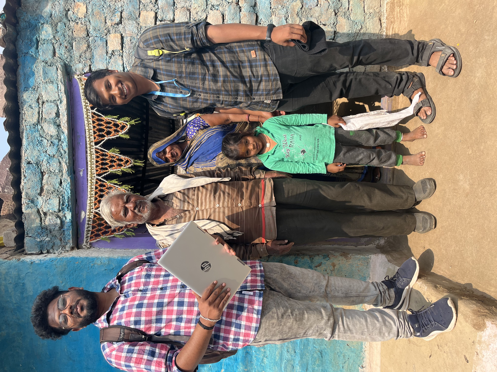
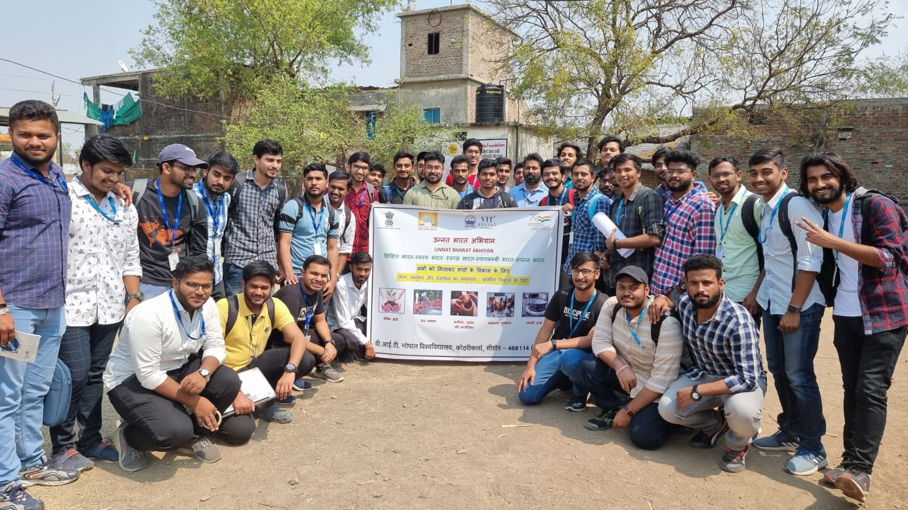
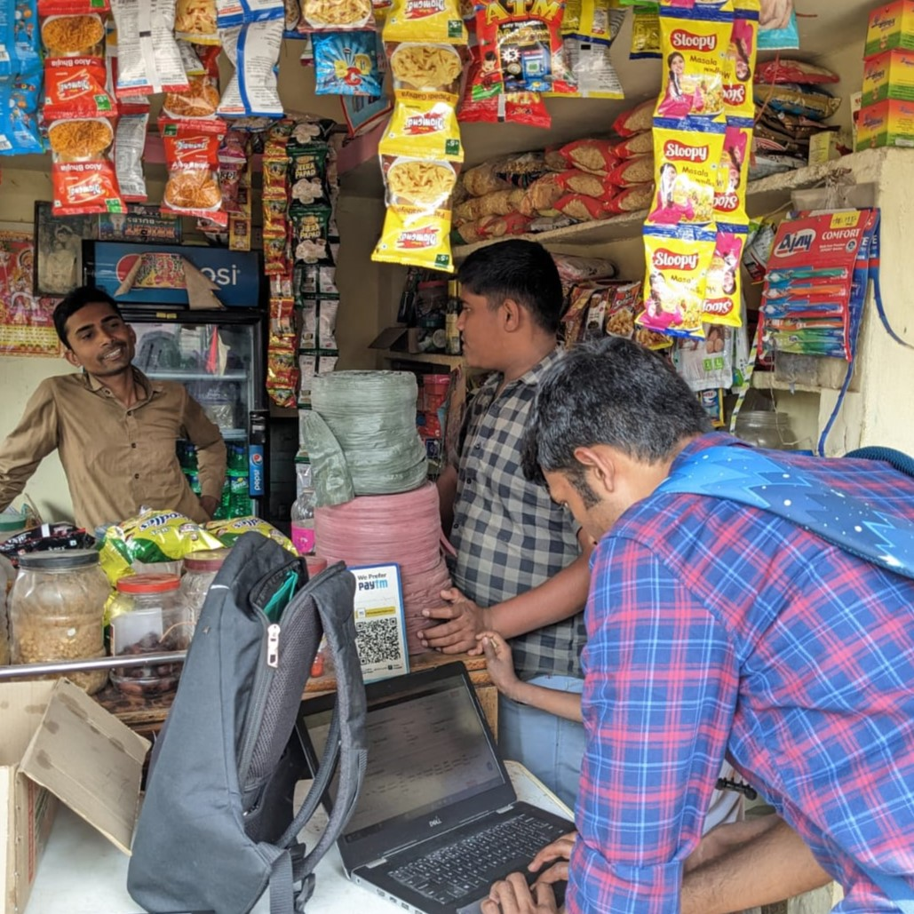

# Heritians - Empowering Villages, Enriching Lives

  

Welcome to the Heritians GitHub repository! This repository serves as the central hub for our transformative project aimed at uplifting self-sufficient and sustainable village clusters across India. Led by our dedicated team in collaboration with VIT Bhopal University and Unnat Bharat Abhiyan (UBA), Heritians is rooted in the vision of indigenous development.

## 🌍 Our Mission

The core mission of Heritians is to leverage the power of cutting-edge Machine Learning technology to revolutionize data collection survey methods in villages near VIT Bhopal University, as allotted by the esteemed Government under the Unnat Bharat Abhiyan scheme. By digitalizing this process, we empower our university and volunteers to gather crucial data that will serve as the foundation for transformative change.

## 🌱 Bridging the Gap

With our ML-based Website project, we bridge the gap between tradition and innovation, bringing together the age-old wisdom of rural communities and the advanced tools of the modern era. By fostering this harmonious union, we create a platform that celebrates cultural heritage while propelling villages towards a brighter future.

  

## 🤝 Enriching Lives, One Village at a Time

At the heart of our endeavor lies our passion for uplifting lives. During a recent visit to the enchanting village of Lasudiya Khas, we were humbled by the overwhelming response from over 70 volunteer students who earnestly engaged with the local community, embracing their lifestyles, and understanding their needs. This experience touched us profoundly, reinforcing our commitment to making a tangible impact at the ground level.

  

## 📊 Unleashing Insights, Enhancing Quality of Life

The data we meticulously collect becomes a wellspring of insights and graphs that serve as guiding stars for developmental endeavors. Armed with this information, we endeavor to collaborate with government bodies, NGOs, and local leaders to implement sustainable initiatives that improve the quality of life for 1000+ villagers.

  

## 🤝 Join the Movement

As we embark on this transformative journey, we extend an open invitation to like-minded individuals and organizations to join us in this mission. Together, we can create ripples of change that reverberate far beyond the boundaries of any one village.

  <a href="#" style="background-color: #009933; color: #fff; padding: 12px 24px; border-radius: 5px; text-decoration: none; font-size: 18px; font-weight: bold;">Join the Heritians movement today</a>

Explore our GitHub repository and contribute to the cause. Be part of the change, and let's build a future where innovation, tradition, and compassion converge to create a prosperous society for all.
